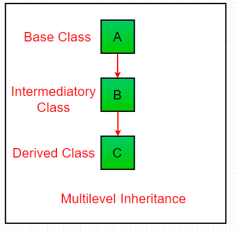

Tính kế thừa
---
- Kế thừa là một trong những khái niệm nền tảng trong lập trình hướng đối tượng OOP. Nó cho phép một lớp con (subclass) kế thừa thuộc tính và phương thức từ một lớp khác(lớp cha - superclass). Từ đó thúc đẩy việc tái sử dụng code và thiết lập mối quan hệ giữa các lớp
- Ưu điểm:
  - Khả năng tái sử dụng mã: viết một lần cho lớp cha và dùng lại cho nhiều lớp con
  - Dễ bảo trì: chỉ cần cập nhật ở lớp cha
  - Khả năng mở rộng: lớp con có thể mở rộng hoặc tùy chỉnh hành vi mà không cần thay đổi mã gốc
 - Áp dụng kế thừa trong phần mềm quản lý trường học:
```
class Person:
    def __init__(self, id, name):
        self.id = id
        self.name = name

class Employee(Person):
    def __init__(self, id, name, salary):
        super().__init__(id, name)
        self.salary = salary

    def printDetails(self):
        print(self.id)
        print(self.name)
        print(self.salary)

e = Employee(101, "Rahul", 40000)
e.printDetails()
```
Output:
```
101
Rahul
40000
```
- Person là lớp cha (superclass), chứa thuộc tính id và name
- Employee là lớp con, kế thừa từ Person và bổ sung thuộc tính salary
- super() dùng để gọ constructor của lớp cha, đảm bảo việc khởi tạo đúng
- printDetails() truy cập cả thuộc tính kế thừa lẫn thuộc tính mới

Ví dụ về cấu trúc phân cấp 
---
```
Person
├── Student
│   ├── EnggStudent
│   └── MgmtStudent
└── Faculty
    ├── Prof
    ├── AstProf
    └── AssociateProf

Employee
├── SalesEmb
├── HREmb
├── MarketingEmb
└── SDEEmb
```
- Person là lớp cha, chứa các thông tin chung cho mọi người trong trường
- Student và Faculty: kế thừa từ lớp Person, đại diện cho sinh viên và giảng viên/nhân sự
- Các lớp con chuyên biệt hơn: EnggStudent, MgmtStudent, Prof...
- Employee: một nhánh khác, cũng có thể kế thừa từ Person

Các khái niệm nâng cao trong Kế thừa
---
### 1. Ghi đè phương thức (Method Overriding)
- Lớp con định nghĩa lại phương thức lớp cha để phù hợp hơn
### 2. Lớp trừu tượng (Abstract classes)
- Được định nghĩa bằng module abc. (Bài 5)

Lớp object trong Python
---
- Trong Python, mọi lớp đều ngầm kế thừa từ lớp dựng sẵn object
```
class ABC:
    pass
```
Tương đương với
```
class ABC(object):
    pass
```
- Lớp object cung cấp các phương thức cơ bản như __str__, __eq__,...

Các loại kế thừa
---
### 1. Single Inheritance
- 1 lớp cha và 1 lớp con, lớp con kế thừa các thuộc tính và phương thức từ lớp cha


### 2. Multilevel Inheritance
- 1 lớp kế thừa từ một lớp kế thừa từ một lớp khác, tạo thành hệ thống đa cấp, tức là một chuỗi kế thừa


### 3. Multiple Inheritance
- Một lớp kế thừa từ nhiều hơn một lớp cha. Đa kế thừa không được hỗ trợ trong một số ngôn ngữ như Java nhưng Python vẫn xử lý được một cách hiệu quả mà không gây nhầm lẫn


### 4. Hierarchical Inheritance
- Nhiều lớp con kế thừa từ một lớp cha duy nhất


### 5. Hybrid Inheritance
- Sự kết hợp của 2 hoặc nhiều loại kế thừa. Có thể là sự kế hợp của kế thừa đa cấp (Multilevel Inheritance) và Kế thừa đa lớp (Multiple Inheritance)


Ghi đè phương thức 
---
- là một lớp con định nghĩa lại phương thức đã được khai báo ở lớp cha
- **Điều kiện**: Tên phương thức và tham số trong lớp con phải giống phương thức của lớp cha
- **Ý nghĩa**: Cho phép lớp con tùy chỉnh hoặc mở rộng hành vi mà lớp cha đã định nghĩa
</br> Kế thừa nhiều cấp (multilevel inheritance):
```
class Person:
    def __init__(self, id, name):
        self.id = id
        self.name = name

    def printDetails(self):
        print(self.id)
        print(self.name)

class Employee(Person):
    def __init__(self, id, name, salary):
        super().__init__(id, name)
        self.salary = salary

    def printDetails(self):
        super().printDetails()
        print(self.salary)

class SalesEmployee(Employee):
    def __init__(self, id, name, sal, si):
        super().__init__(id, name, sal)
        self.salesInc = si

    def printDetails(self):
        super().printDetails()
        print(self.salesInc)

# Tạo đối tượng
se = SalesEmployee(101, "Rahul", 40000, 2000)
e = Employee(102, "Sandub", 50000)

# In thông tin
se.printDetails()
e.printDetails()
```
Output:
```
101
Rahul
40000
2000
102
Sandub
50000
```
- **Method Resolution Order (MRO)**: Cách quyết định gọi method nào. Vd với se.printDetails(), đầu tiên tìm ở se.printDetails, có -> dùng luôn, nếu không thì tìm ở Employee sau đó mới đến Person
- **Hàm super()**: Dùng để gọi constructor hoặc method từ lớp cha trong lớp con. Đảm bảo chuỗi kế thừa hoạt động mạch lạc

Vấn đề Multiple Inheritance 
---
```
class Student:
    def __init__(self, sid, dept):
        self.sid = sid
        self.dept = dept

class Faculty:
    def __init__(self, eid, dept):
        self.eid = eid
        self.dept = dept

class PhDStudent(Student, Faculty):   # kế thừa từ cả 2
    def __init__(self, id, dept):
        super().__init__(id, dept)
```
- Khi dùng super(), Python sẽ theo thứ tự liệt kê cha (tức Student trước, Falcuty sau) nên super().__init__(id, dept) chỉ gọi constructor của Student, không gọi của Falcuty nên eid không được khởi tạo -> nếu cần phải tự khởi tạo thêm trong constructor của PhDStudent
- **Diamond Problem**:
```
        Person
     /      \
 Student   Faculty
     \      /
    PhDStudent
```
-> Vấn đề: khi gọi super(), Person sẽ được gọi mấy lần? Nếu gọi 2 lần thì Person sẽ bị khởi tạo 2 lần -> lỗi
</br>-> Python giải quyết bằng MRO: chỉ gọi 1 lần duy nhất theo thứ tự khai báo
- Vấn đề thực tế khi dùng Multiple inheritance:
  - Xung đột thuộc tính: Nếu 2 cha có cùng tên biến thì không rõ lấy của cái nào
  - Xung đột method: Nếu 2 cha có cùng tên method thì python sẽ chọn theo MRO
  - Thiếu thuộc tính: Nếu theo MRO, thuộc tính của 1 lớp cha không được gọi, sau đó không được khởi tạo lại ở lớp con thì khi gọi sẽ bị lỗi

Best Practice
---
- Hạn chế dùng Multiple inheritance
- Thường thì composition dễ bảo trì hơn
- Tức là thay vì:
```
class PhDStudent(Student, Faculty):
    ...
```

ta viết:
```
class PhDStudent:
    def __init__(self, student: Student, faculty: Faculty):
        self.student = student
        self.faculty = faculty
```
